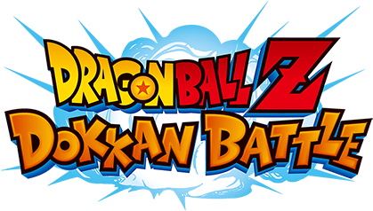

# Statistical Analysis of Dragon Ball Z Dokkan Battle Character Units

</img>

</img>

Project for North Hennepin Community College by Martin Vazquez

Class: Interdisciplinary Applications in Data Science (DSCI 2009)

Instructor: Jack Pope

Initial Project Upload: April 24th, 2024

Last update: May 8th, 2024

## Summary
Dragon Ball Z Dokkan Battle is a mobile game based on the popular Dragon Ball Z franchise. It combines elements of puzzle, strategy, and role-playing games. Players assemble teams of characters from the Dragon Ball universe and engage in battles against various enemies and bosses.

The game utilizes a turn-based combat system where players must strategically choose their actions to defeat their opponents. One of the key components of gameplay is understanding and utilizing character stats effectively.

Here's a breakdown of the main stats and how they are used in Dokkan Battle:
1.	HP (Health Points): HP represents the character's health. When a character's HP drops to zero, they are defeated. Players must manage their team's HP by strategically using healing items or abilities.
2.	ATK (Attack): ATK determines the amount of damage a character deals with their attacks. Higher ATK means more damage inflicted on enemies.
3.	DEF (Defense): DEF reduces the amount of damage a character takes from enemy attacks. Higher DEF means the character can withstand more damage.
4.	Ki (Energy): Ki is used to perform special attacks or abilities. Characters collect Ki spheres during battle to charge their Ki gauge. The amount of Ki required for a special attack varies depending on the character and the strength of the attack.
5.	Leader Skill: Each character has a leader skill that provides a passive bonus to the team when they are set as the leader. These bonuses can include increased stats for certain types of characters or effects that enhance the team's performance in battle.
6.	Leader Skill: Each character has a leader skill that provides a passive bonus to the team when they are set as the leader. These bonuses can include increased stats for certain types of characters or effects that enhance the team's performance in battle.

Understanding these stats and how they interact with each other is crucial for building effective teams and winning battles in Dragon Ball Z Dokkan Battle. Players often strategize by forming teams with characters that complement each other's strengths and abilities to overcome challenging opponents.

For my analyses I will only be looking at the HP, ATK, and DEF stat as the other main stats have too many variables that I cannot account for and plan to utilized those stats in conjunction with potential leader utilization which can be for lead chracters of certain class, type, or categories.

## Summary Statistics
  
### Character Count  

  
### ATK vs DEF Stat overall and by type

  
### HP, ATK, and DEF Stat Distribution

### Top ten Characters in HP, ATK, and DEF (For Fun)
  

## Data Source
All Character stat data was obtain from the [Dokkan Wiki](https://dbz-dokkanbattle.fandom.com/wiki/Dragon_Ball_Z_Dokkan_Battle_Wiki).

## Conclusion
Super class characters, aka the good guys, outnumber extreme class characters, aka the bad guys, within the game. This leads to characters that can lead other characters that are super class more favorable as the player would have more options.  

When it comes to characters that lead by type the one in the lead is STR characters but overall, the number of characters that each of the five types have within the game are spread out evenly not giving any one type an overall advantage over another type.  

Category analysis is TBD at a later date when the containing spreadsheet is updated to contain all the categories that each of the characters can belong to but could not be finished within the initial projects timeframe with over 1000 characters and over 90 categories that any one character can belong to multiple categories.